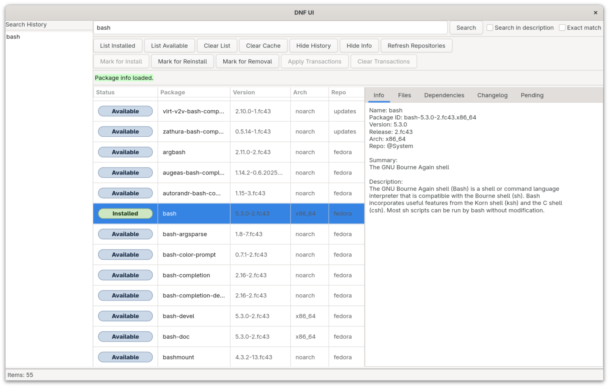

# DNF UI

  

**DNF UI** is a modern graphical frontend for Fedora’s **DNF package manager**,
inspired by the classic **Synaptic** tool on Debian and Ubuntu.

Built with **GTK 4** and **libdnf5**, it provides a simple, reliable, and efficient way to manage software packages on Fedora.

  

