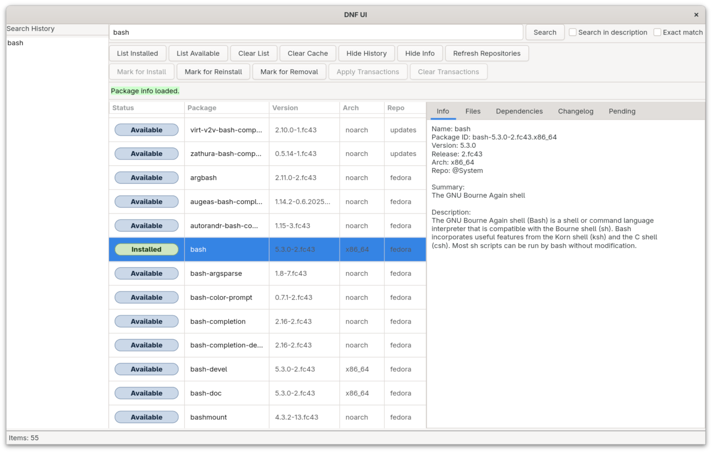

# DNF UI

<p align="center">
  
</p>

DNF UI is a graphical frontend for Fedora's DNF (Dandified YUM) package manager, inspired by [Synaptic](https://github.com/mvo5/synaptic).
It is built with GTK 4 and libdnf5 and aims to provide a **fast** and **dependable** package management workflow for Fedora.

## Status

DNF UI is in early development.
The project is active and progressing quickly, but it is not yet a stable replacement for existing package management tools.
Interfaces, behavior, and features may change while the application is being stabilized.

## Goals and development principles

- User experience first
- Stability, reliability and predictability
- Strong focus on code quality and maintainability
- No unnecessary complexity or bloat

## Current features

- Search repo packages together with installed-only local RPMs
- List installed packages or browse the merged package view
- View package details, files, dependencies, and changelog information
- Mark packages for install, reinstall, and removal
- Review a transaction summary before applying changes
- Apply transactions through a privileged system service with Polkit authorization
- Cancel long-running package queries
- Show search history
- Hide or show the history and information panes

The main browse and search views keep one visible row per package name and
architecture. Repo candidates stay visible as usual, and locally installed RPMs
that are not present in enabled repositories are merged in as `Installed (local
only)` entries instead of being hidden.

## Why?

I started DNF UI because I am not satisfied with the current graphical package management options on Fedora.
I want a package manager frontend that feels fast, reliable, and easy to understand in daily use.

This project is also a practical way for me to learn more about libdnf5, GTK 4, and building a
maintainable desktop application.
The goal is not to experiment for its own sake, but to build something genuinely useful for me and others.

## Build

### Native build

Build dependencies:

- meson
- ninja-build
- libdnf5-devel
- gtk4-devel
- polkit
- polkit-devel

Meson handles the real build and install logic.
The `Makefile` is a thin task runner for the common developer commands.

Build and run:

```sh
make && ./dnfui
```

Build final and run:

```sh
FINAL=y make && ./dnfui
```

Run the Meson setup directly:

```sh
meson setup build/debug --prefix /usr --libexecdir libexec
meson compile -C build/debug
./build/debug/src/dnfui
```

## Polkit integration

DNF UI uses a small privileged transaction service for package apply operations.

The GUI runs as the regular desktop user, while the service runs on D-Bus and is
responsible for the privileged transaction step.

[Polkit](https://github.com/polkit-org/polkit) is used only for the apply step:

- Transaction preview is prepared through the service
- The GUI shows the summary dialog
- Apply is authorized by Polkit on the native system bus

This keeps the main application **unprivileged** while still allowing normal desktop
authentication when a transaction is applied.

### Native service install for development

For native Polkit testing from the source tree, install the service files with:

```sh
make
sudo make serviceinstall
```

Then run the app as a regular desktop user:

```sh
./dnfui
```

When you apply a transaction, the desktop Polkit prompt should appear.

Remove the development service install with:

```sh
sudo make serviceuninstall
```

**NOTE:**

- `serviceinstall` is a development helper, not the final packaging flow
- Choose a non critical installed package for native apply tests
- `sudo make serviceinstall` installs the already built Meson service files from the current build tree and does not rebuild

### Tests

Test dependencies:

- gio-2.0
- catch-devel on Fedora, which provides `pkgconfig(catch2-with-main)`

Run the test suite:

```sh
make test
```

Run the full native test matrix, including transaction service smoke tests:

```sh
SERVICE_TEST_INSTALL_SPEC=cowsay make nativetests
```

### Memory checks

Run a quick smoke test under Valgrind Memcheck:

```sh
make memcheck
```

Run the automated test binary under Valgrind Memcheck:

```sh
make memcheck-tests
```

`make memory-check` currently runs the full automated Memcheck target.

Run the desktop app under Valgrind Memcheck:

```sh
make memcheck-app
```

Memcheck logs are written under `build/memcheck/`.

The default Memcheck setup fails on definite and indirect leaks from this
project. Reachable and possible leak noise from GLib, GTK, DNF, and related
libraries is suppressed in `utils/valgrind-dnfui.supp`.

Useful options:

```sh
MEMCHECK_SMOKE_FILTER="Transaction request validation rejects an empty request" make memcheck
MEMCHECK_SMOKE_TIMEOUT=5m make memcheck
MEMCHECK_TEST_FILTER="Search returns empty for impossible package name" make memcheck-tests
MEMCHECK_TEST_TIMEOUT=10m make memcheck-tests
MEMCHECK_TRACK_FDS=yes make memcheck-tests
MEMCHECK_GEN_SUPPRESSIONS=yes make memcheck-tests
```

### Docker

Build the development image:

```sh
make dockersetup
```

Run the application:

```sh
make dockerrun
```

Run the system bus service smoke tests in Docker:

```sh
make dockerservicesystemtest
make dockerservicesystemapplytest
```

Run the test suite in Docker:

```sh
make dockertest
```

Run the full Docker-backed test matrix:

```sh
make dockertests
```

Docker notes:

- `make dockerrun` uses the session bus service path for convenience
- Use the `dockerservicesystem*` targets to test the real system bus authorization flow
- Use native Fedora to test the real desktop Polkit prompt

## RPM packaging

Fedora RPM packaging is included in this repository.

Build a source RPM from the current tracked working tree:

```sh
make srpm
```

Build binary and source RPMs locally:

```sh
make rpm
```

Build a source RPM in Docker:

```sh
make dockersrpm
```

Build binary and source RPMs in Docker:

```sh
make dockerrpm
```

Artifacts are written under `./rpmbuild/`.

Notes:

- The RPM build uses Meson directly, not the development `Makefile install` flow
- The source tarball generated by `make srpm` is built from the current tracked working tree
- The Docker RPM targets use the existing Fedora development image and write artifacts into the same `./rpmbuild/` tree
- To test the package in a clean Fedora build environment, rebuild the generated SRPM with `mock`

## Screenshot

<p align="center">
  
</p>
