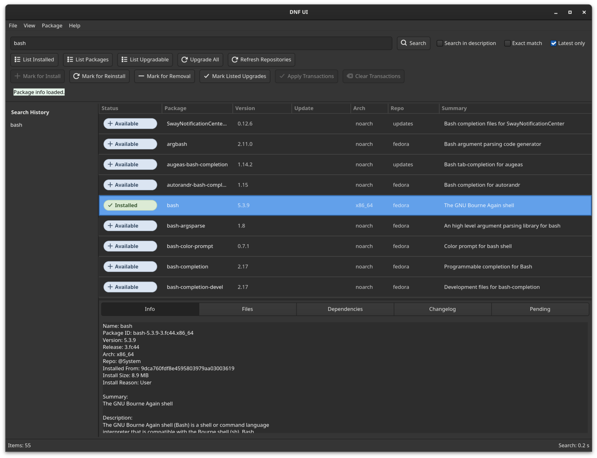
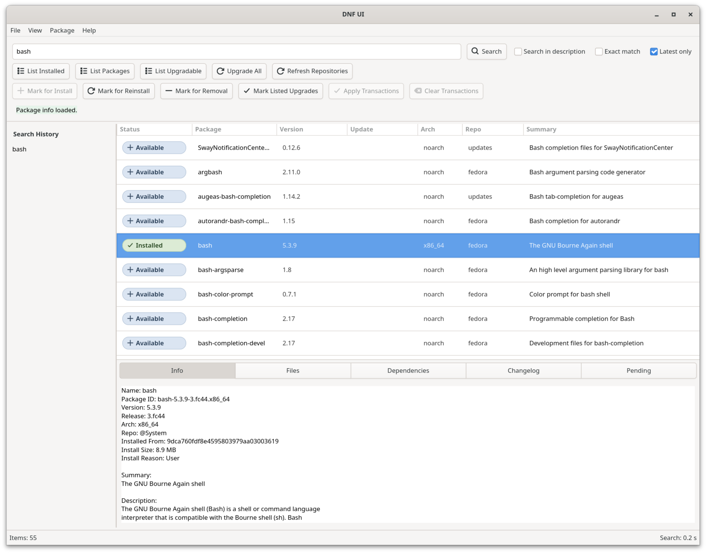

# DNF UI

<p align="center">
  
</p>

[](https://github.com/dnfui/dnf-ui/actions/workflows/ci.yml)
[](https://github.com/dnfui/dnf-ui/actions/workflows/shellcheck.yml)
[](https://github.com/dnfui/dnf-ui/actions/workflows/release-rpm.yml)
[](https://github.com/dnfui/dnf-ui/actions/workflows/publish-copr.yml)

**DNF UI** is a graphical frontend for DNF5 (Dandified YUM), inspired by [Synaptic](https://github.com/mvo5/synaptic).
It is built with [GTK 4](https://docs.gtk.org/gtk4/) and [libdnf5](https://github.com/rpm-software-management/dnf5) and
aims to provide a **fast** and **dependable** package management workflow for DNF5 systems.

## Supported platform

DNF UI targets systems using modern **DNF5** and **dnf5daemon**. It is developed and tested primarily on Fedora Linux.

## Status

DNF UI is under active development and is stable for regular use. \
New features and improvements are still being added, so some interfaces and
behavior may change between releases.

## Install from COPR

DNF UI is available from [COPR](https://copr.fedorainfracloud.org/coprs/):

<https://copr.fedorainfracloud.org/coprs/erikmn/dnf-ui/>

Enable the repository and install the app:

```sh
sudo dnf install dnf5-plugins
sudo dnf copr enable erikmn/dnf-ui
sudo dnf install dnf-ui
```

## Goals and principles

- User experience first!
- Reliable and fast
- Strong focus on code quality and maintainability
- No unnecessary complexity or bloat

## Scope

DNF UI is a package manager frontend, **NOT** an app store.

It focuses on fast package search, package details, installed package inspection,
explicit transaction review, and applying DNF package transactions through Polkit.

DNF UI does **NOT** aim to manage Flatpaks, firmware updates, ratings, featured
applications, or software-center discovery workflows.
Applications such as [GNOME Software](https://apps.gnome.org/Software/) cover those workflows.

## Current features

- Search packages from enabled repositories and installed local RPMs
- Browse available, installed, and upgradable packages
- Switch between latest-version and exact-version views
- View package details, files, dependencies, and changelogs
- Mark packages for installation, upgrade, downgrade, reinstallation, or removal
- Select which available updates to apply or upgrade everything
- Review all package changes before applying a transaction
- Apply package changes through dnf5daemon with Polkit authorization
- Cancel long-running package queries
- Search previous queries
- Export the visible package list as CSV
- Browse DNF transaction history

## Why?

As a long-time user of Synaptic, I wanted a similar tool for DNF5:
a native package manager frontend that is fast, reliable, and easy to use.

This project is also a practical way for me to learn more about building a stable and maintainable desktop application.
The goal is not experimentation for its own sake, but to build something genuinely useful for me and others.

Other graphical package managers with a longer history include:

- [dnfdragora](https://github.com/manatools/dnfdragora)
- [yumex-ng](https://github.com/timlau/yumex-ng)
- [gnome-software](https://gitlab.gnome.org/GNOME/gnome-software)

## Contributing

See [docs/contributing.md](docs/contributing.md).

## Development

Fedora build dependencies are listed in
[docs/fedora-native-dependencies.txt](docs/fedora-native-dependencies.txt).

Install them, then build and run:

```sh
./utils/install_fedora_dependencies.sh
make && ./dnfui
```

Run the native test suite:

```sh
make test
```

For native transaction testing, Docker commands, and local RPM packaging, see
[docs/development.md](docs/development.md).

For the full test matrix, see [docs/testing.md](docs/testing.md).

For architecture notes and source-backed external API assumptions, start with
[docs/architecture.md](docs/architecture.md).

## Package transactions

DNF UI uses DNF5's **dnf5daemon** for package changes.

`dnfui` runs as the regular desktop user. Transaction preview and apply go
through dnf5daemon on the system bus, and dnf5daemon handles the privileged
package operation and Polkit behavior.

This keeps the main application **unprivileged** while still allowing normal desktop
authentication when a transaction is applied.

For the full transaction flow, see [docs/transactions.md](docs/transactions.md).

## Screenshots

<p align="center">
  
</p>

<p align="center">
Dark theme.
</p>

<p align="center">
  
</p>

<p align="center">
Light theme.
</p>
