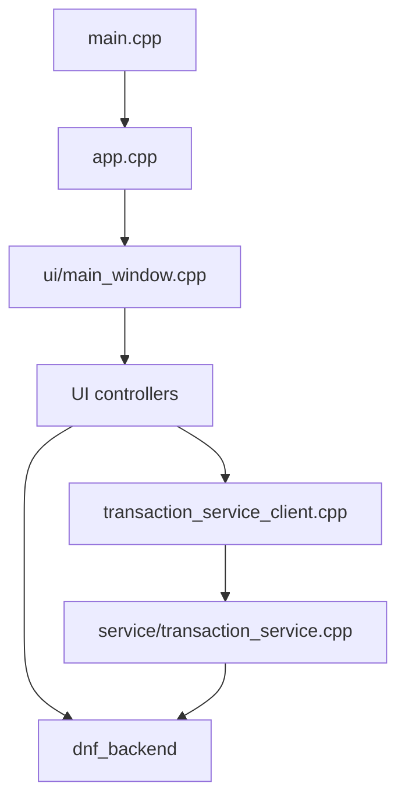
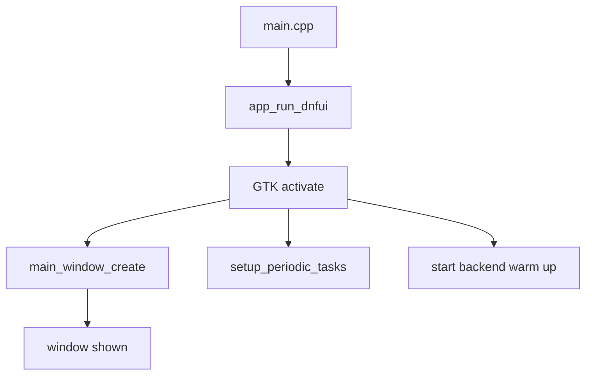
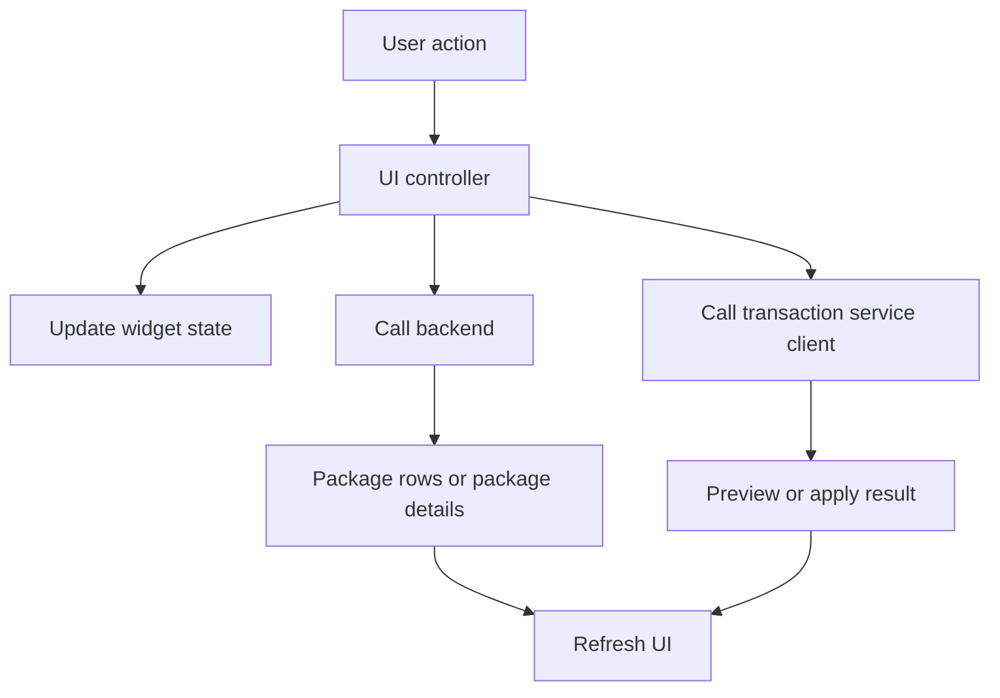
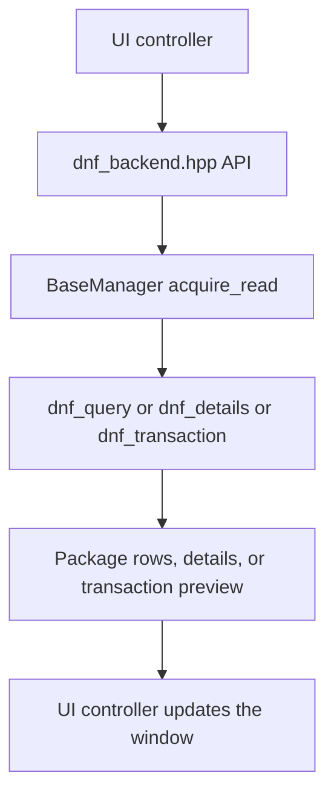
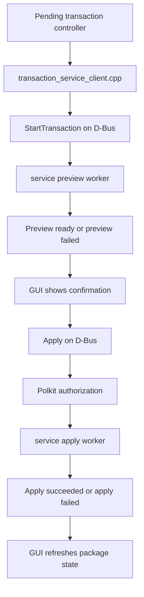
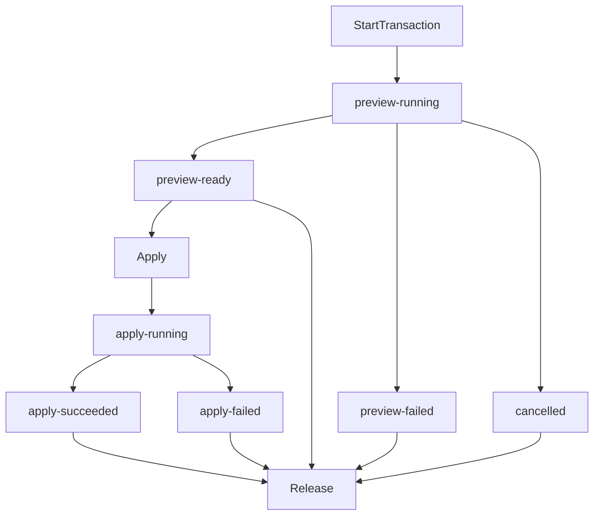

# DNF UI Architecture

This document is a short map of the application.

Its purpose is to help you answer these questions quickly:

- Where does the app start
- Which part of the UI owns what
- Where package data comes from
- When the transaction service is involved
- Where tests live

This is not a full design document.
It is a practical guide for reading and maintaining the code.

## Top level picture

DNF UI has four main parts:

- App startup and main window setup
- UI controllers
- libdnf5 backend
- Transaction service and GUI client

## Startup flow

The app starts in a small chain of files:

- [src/main.cpp](../src/main.cpp)
- [src/app.cpp](../src/app.cpp)
- [src/ui/main_window.cpp](../src/ui/main_window.cpp)

What each file does:

- `main.cpp` starts the GTK application
- `app.cpp` owns application activation and background startup work
- `main_window.cpp` builds the main window, shared widget state, and signal wiring

## Main window and UI ownership

The UI code is grouped by responsibility under `src/ui`.

The important idea is:

- `main_window.cpp` builds the window and wires signals
- controller files own behavior for one part of the window
- helper files support the controllers and widgets

### Main UI modules

- [src/ui/main_window.cpp](../src/ui/main_window.cpp)
  Builds the main window and shared `SearchWidgets` state.

- [src/ui/main_menu.cpp](../src/ui/main_menu.cpp)
  Owns top menu actions such as About, Quit, and panel visibility.

- [src/ui/package_query_controller.cpp](../src/ui/package_query_controller.cpp)
  Owns search, browse, installed-list loading, request cancellation, history, and list refresh.

- [src/ui/package_info_controller.cpp](../src/ui/package_info_controller.cpp)
  Owns the info pane for the selected package.

- [src/ui/pending_transaction_controller.cpp](../src/ui/pending_transaction_controller.cpp)
  Owns marked package actions, preview requests, apply requests, and refresh after apply.

- [src/ui/transaction_progress.cpp](../src/ui/transaction_progress.cpp)
  Owns the transaction progress dialog shown during apply.

- [src/ui/package_table_view.cpp](../src/ui/package_table_view.cpp)
  Owns the package list view widget behavior.

- [src/ui/package_table_context_menu.cpp](../src/ui/package_table_context_menu.cpp)
  Owns right-click actions for package rows.

### UI flow

## Shared widget state

The main shared UI state lives in:

- [src/ui/widgets.hpp](../src/ui/widgets.hpp)

This file is important because it shows:

- the GTK widgets the controllers share
- query state
- transaction state
- window state

When you are unsure who owns a piece of UI state, start there.

## Backend ownership

The backend hides libdnf5 details from the UI.

The public backend contract lives in:

- [src/dnf_backend/dnf_backend.hpp](../src/dnf_backend/dnf_backend.hpp)

The backend is built around a shared `BaseManager`:

- [src/base_manager.cpp](../src/base_manager.cpp)

`BaseManager` owns the shared libdnf5 `Base` and protects access to it.

### Main backend modules

- [src/dnf_backend/dnf_query.cpp](../src/dnf_backend/dnf_query.cpp)
  Search, browse, and installed-package row queries.

- [src/dnf_backend/dnf_details.cpp](../src/dnf_backend/dnf_details.cpp)
  Package details, files, changelog, and dependency text.

- [src/dnf_backend/dnf_state.cpp](../src/dnf_backend/dnf_state.cpp)
  Installed snapshot, package state classification, install reason, and protected package state.

- [src/dnf_backend/dnf_transaction.cpp](../src/dnf_backend/dnf_transaction.cpp)
  Transaction preview and apply helpers.

### Backend flow

## Installed snapshot and package state

A lot of UI correctness depends on the installed snapshot.

The main code for that is in:

- [src/dnf_backend/dnf_state.cpp](../src/dnf_backend/dnf_state.cpp)

This code answers questions like:

- Is this exact package installed
- Is it local only
- Is it upgradeable
- Is the installed version newer than the repo version
- Why was it installed

The periodic snapshot refresh is started in:

- [src/app.cpp](../src/app.cpp)

That refresh now runs in a background task so it does not block the GTK thread.

## Transaction service boundary

Package search and package details stay inside the GUI process.

Transaction preview and apply go through a small D-Bus service:

- GUI side: [src/transaction_service_client.cpp](../src/transaction_service_client.cpp)
- service side: [src/service/transaction_service.cpp](../src/service/transaction_service.cpp)

Shared D-Bus names live in:

- [src/service/transaction_service_dbus.hpp](../src/service/transaction_service_dbus.hpp)

### Why the service exists

The GUI stays unprivileged.
The service handles the privileged transaction step and Polkit authorization.

### Service flow

### Service lifecycle in simple terms

One transaction request normally goes through this shape:

Important rules:

- the service owns the request object
- the GUI reads result state through the client helper
- the GUI should release finished requests it no longer needs
- if the service disappears while the GUI is waiting, the client now returns an error instead of hanging

## Packaging and service install files

Service packaging files live under `packaging`.

The important ones are:

- [packaging/com.fedora.Dnfui.Transaction1.service](../packaging/com.fedora.Dnfui.Transaction1.service)
- [packaging/com.fedora.Dnfui.Transaction1.conf](../packaging/com.fedora.Dnfui.Transaction1.conf)
- [packaging/com.fedora.dnfui.policy](../packaging/com.fedora.dnfui.policy)
- [packaging/dnfui-service.service](../packaging/dnfui-service.service)

Meson owns the real build and install logic.
The `Makefile` is a task runner for common developer commands.

## Tests

The test coverage is split between unit-style tests and service smoke tests.

### Catch2 tests

These live under `test`:

- [test/test_backend.cpp](../test/test_backend.cpp)
- [test/test_search.cpp](../test/test_search.cpp)
- [test/test_transaction_preview.cpp](../test/test_transaction_preview.cpp)
- [test/test_transaction_request.cpp](../test/test_transaction_request.cpp)
- [test/test_transaction_service_client.cpp](../test/test_transaction_service_client.cpp)

These protect:

- backend query behavior
- transaction preview behavior
- transaction request validation
- GUI-side transaction client behavior

### Shell smoke tests

These live under `utils` and `docker`:

- [utils/test_transaction_service_preview.sh](../utils/test_transaction_service_preview.sh)
- [utils/test_transaction_service_cancel.sh](../utils/test_transaction_service_cancel.sh)
- [utils/test_transaction_service_apply.sh](../utils/test_transaction_service_apply.sh)
- [utils/test_transaction_service_preview_failure.sh](../utils/test_transaction_service_preview_failure.sh)
- [utils/test_transaction_service_system_bus.sh](../utils/test_transaction_service_system_bus.sh)

These protect:

- session bus preview flow
- session bus cancel flow
- session bus apply flow
- preview worker failure handling
- system bus authorization and install flow
- disconnect cleanup

## Where to start when reading the code

If you want to re-learn the app quickly, this is a good order:

1. [src/main.cpp](../src/main.cpp)
2. [src/app.cpp](../src/app.cpp)
3. [src/ui/main_window.cpp](../src/ui/main_window.cpp)
4. [src/ui/package_query_controller.cpp](../src/ui/package_query_controller.cpp)
5. [src/ui/pending_transaction_controller.cpp](../src/ui/pending_transaction_controller.cpp)
6. [src/dnf_backend/dnf_backend.hpp](../src/dnf_backend/dnf_backend.hpp)
7. [src/base_manager.cpp](../src/base_manager.cpp)
8. [src/transaction_service_client.cpp](../src/transaction_service_client.cpp)
9. [src/service/transaction_service.cpp](../src/service/transaction_service.cpp)
10. [test/test_transaction_service_client.cpp](../test/test_transaction_service_client.cpp)

## What this document is not

This document does not try to explain every file.

Its job is simpler:

- give you a map
- show the main flows
- help you find the right place to read next
